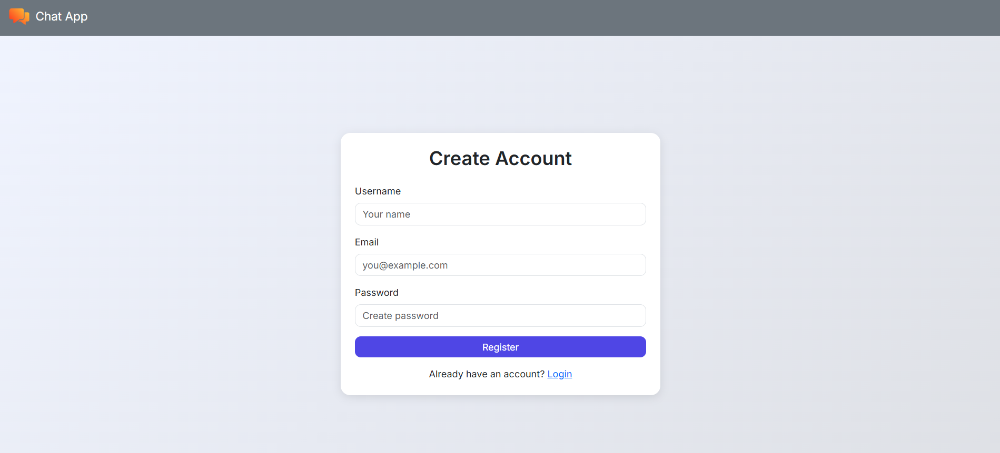
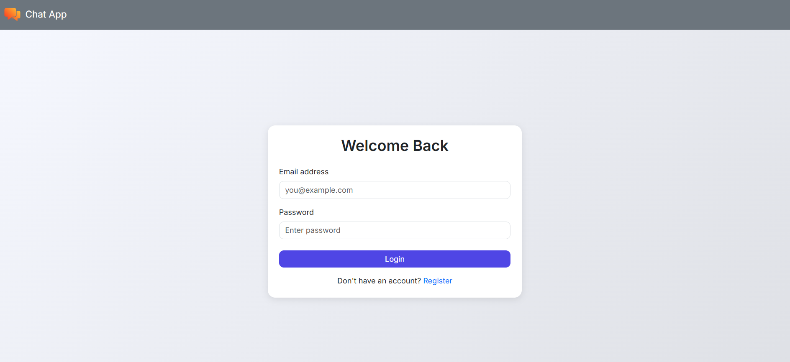
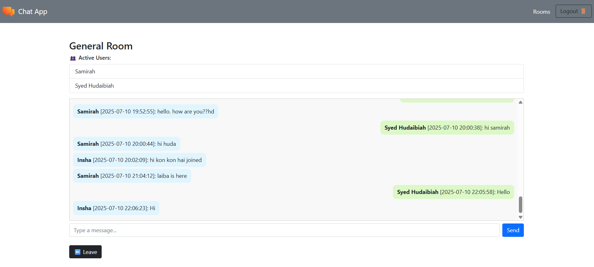
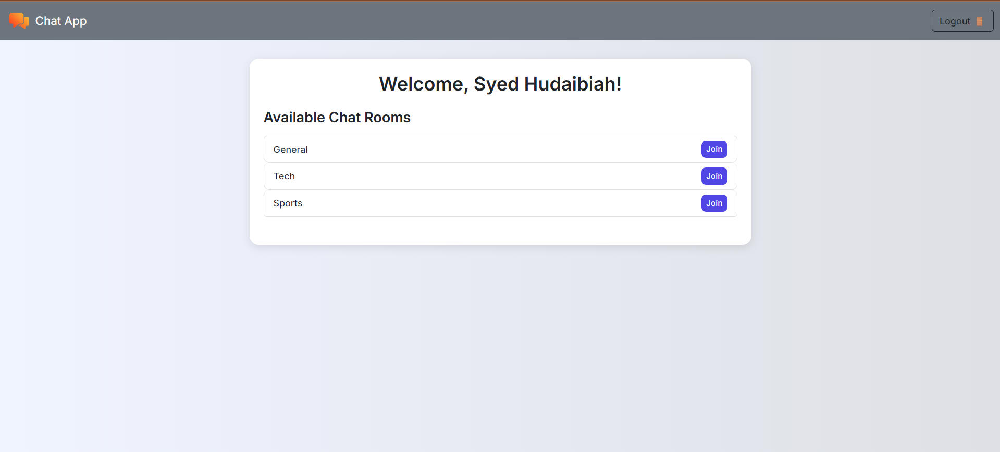

# 💬 Real-Time Chat Application

A web-based real-time chat app using *PHP, **JavaScript, **MySQL, and **Ratchet WebSockets*. Users can log in, join chat rooms, and exchange messages in real time.

---
 📁 Features

- 🔐 User login & registration
- 💬 Real-time messaging with WebSockets
- 👀 Typing indicators
- 🧑‍🤝‍🧑 Active user list in each chat room
- 🕓 Message timestamps
- 💾 Persistent chat history stored in MySQL
- 🏠 Multiple chat rooms

---

## 🛠 Setup Instructions

### Prerequisites

- XAMPP (for Apache & MySQL)
- PHP (included in XAMPP)
- Composer (for managing Ratchet WebSocket dependency)
- Git (optional)

---

 Clone the Repository

bash
git clone https://github.com/[Your UserName]/Real-time-Chat-Application.git
cd chat-app

Install Ratchet WebSocket Library
bash
composer require cboden/ratchet

Import the Database
If you're using MySQL via XAMPP Shell, follow these steps:

Open terminal and navigate to MySQL directory:

bash
cd C:\xampp\mysql\bin

Enter MySQL shell:

bash
mysql -u root

Run the following in the MySQL shell:
sql
CREATE DATABASE chat-app;
USE chat_app;
SOURCE C:\xampp\htdocs\chat-app\database.sql;

Run the WebSocket Server
From your project folder:
bash
php websocket-server.php

Make sure port 8080 is free.

🔐 Sample Login Credentials
Email: syedinsha@gmail.com
Password: insha0202

🗂 Project Structure

chat-app/
├── vendor
├── db.php
├── login.php
├── logout.php
├── register.php
├── dashboard.php
├── chat-server.php
├── chatroom.php
├── fetch_messages.php
└── database.sql

  💻 Web App Preview
  📸 Screenshots

  ### 📝 Registration Page

### 🔐 Login Page

### 💬 Chatbox View

### 🧑‍🤝‍🧑 Chat Room

